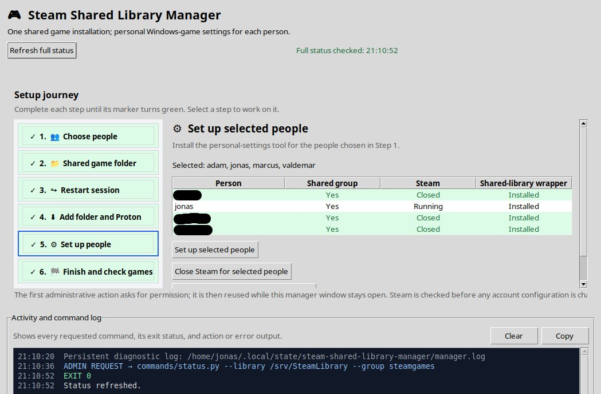

# Steam Shared Library Manager

Share one Steam game installation between several Linux accounts without
sharing settings, Proton state, or non-cloud saves. This makes steam behave
similar to Windows for multiple users on the same computer.

Steam normally puts non-linux game's Proton prefix beside the shared game in
`steamapps/compatdata/<appid>`. This project installs a small compatibility
wrapper that instead uses:

```text
$XDG_DATA_HOME/steam-shared-library-proton/<appid>
```

Each Linux account therefore gets a private prefix while game assets and the
official Proton installation remain shared. Native Linux games are unaffected.
Steam displays the wrapper as **Shared library – personal settings (Proton)**.



## Supported setup

- Ubuntu or Debian with the native Steam client
- a local Linux filesystem with ownership, setgid, and ACL support
- Python 3 with Tkinter, `pkexec`, and the `acl` tools
- trusted household accounts that already have the necessary Steam licenses

Snap and Flatpak Steam are deliberately refused because their sandboxes use
different paths and cannot safely use the same system library. FAT/exFAT and
typical network shares are not suitable.

On Ubuntu, install the prerequisites and start Steam once:

```bash
sudo add-apt-repository multiverse
sudo dpkg --add-architecture i386
sudo apt update
sudo apt install acl pkexec python3-tk steam-installer
/usr/games/steam
```

## Quick start

Clone this repository from GitHub, then run:

```bash
git clone https://github.com/lindeloev/steam-shared-library-manager.git
cd steam-shared-library-manager
./launch-gui.sh
```

Alternatively, [download the source as a ZIP][source-zip] and extract it. If
executable permissions were lost in the download, use:

```bash
sh ./launch-gui.sh
```

The manager guides you through six steps:

1. Choose the Linux accounts that will share games.
2. Prepare a missing/empty folder, or inspect and repair an existing Steam
   library.
3. Log out and back in so new group membership reaches the desktop session.
4. Add the folder to one Steam account and install an official Proton there.
5. Close Steam, install the personal-settings wrapper, and optionally register
   the shared folder as each person's default Steam storage.
6. Finish the remaining account-specific Steam setting and check game status.

Step 4 includes an illustrated, previous/next Steam guide showing where to add
the shared storage folder, find an official Proton under **Library → Tools**,
and—after Step 5—select the personal-settings tool under
**Settings → Compatibility**.

For a new library, `/srv/SteamLibrary` is a sensible default. Step 5 registers
it and makes it the default storage for each selected person unless that
default-on option is unchecked. Each person still selects the wrapper under
**Settings → Compatibility**.

Selections survive the required logout/login in:

```text
~/.config/steam-shared-library-manager/state.json
```

Passwords, authorization, and cached status are never stored.

## What the manager is allowed to do

The GUI starts without administrator access. The first privileged action uses
the normal PolicyKit prompt, then keeps one narrowly scoped helper alive until
the window closes. The manager will not close while an operation is active.

The bottom **Activity and command log** shows every requested command with
shell-style argument quoting, its exit code, and its full output. A private
persistent copy is kept at:

```text
~/.local/state/steam-shared-library-manager/manager.log
```

All programs that inspect or change Steam, account, library, or prefix state
live in [`commands/`](commands/README.md). The privileged helper accepts a fixed
allow-list and passes arguments directly—never through a shell. Mutating
commands preflight paths and accounts, refuse unsafe Steam-root symlinks, and
use collision-resistant backups and same-directory temporary files before
atomically replacing Steam configuration.

Personal prefix directories are forced to mode `700` during installation and
whenever the wrapper starts. Shared game files and the shared Proton
installation are writable by the selected access group, so group members must
be trusted: any member able to update shared games can also alter executables
another member may later run.

## Command line

The same operations are available without the GUI. For example:

```bash
# Create a new library. PATH must be missing or empty.
sudo ./commands/setup-shared-library.sh \
  --library /srv/SteamLibrary --group steamgames user1 user2

# Add people, install the wrapper, and make the shared folder their default.
sudo ./commands/add-user.sh --close-steam \
  --default-library /srv/SteamLibrary --group steamgames \
  --base-proton '/srv/SteamLibrary/steamapps/common/Proton - Experimental' \
  user1 user2

# Preview, then migrate explicit per-game Proton selections.
sudo ./commands/migrate-existing-games.sh --dry-run user1 user2
sudo ./commands/migrate-existing-games.sh --apply user1 user2
```

Run any script with `--help` and see
[`commands/README.md`](commands/README.md) for the complete command inventory.

## Update or remove

Close Steam and rerun `install.sh` to update the wrapper or select a different
shared official Proton.

To remove only this project's Steam registration:

```bash
sudo ./commands/uninstall.sh user1 user2
```

Existing per-user prefixes and shared games remain. Removing prefixes can erase
local saves and settings, so it requires an explicit flag:

```bash
sudo ./commands/uninstall.sh --remove-prefixes user1 user2
```

## Scope and testing

This helper does not bypass Steam Families, licensing, anti-cheat, or individual
game limitations. It only separates per-user Proton data from shared assets.

The current implementation has been usage-tested on two multi-user Ubuntu
26.04 systems. Development was AI-assisted; review and testing are ongoing.
Contributions and reports from other native Debian/Ubuntu configurations are
welcome through the [GitHub issue tracker][issues].

Run the standard-library regression tests with:

```bash
python3 -m unittest discover -s tests -v
```

GitHub Actions runs these tests plus Python compilation, POSIX shell syntax
checks, and ShellCheck on each push and pull request.

Licensed under the [MIT License](LICENSE).

[issues]: https://github.com/lindeloev/steam-shared-library-manager/issues
[source-zip]: https://github.com/lindeloev/steam-shared-library-manager/archive/refs/heads/main.zip
